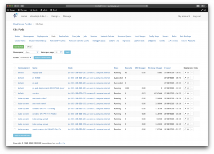

## CloudDrip Cloud Orchestration and Management Web Application

CloudDrip is a Multi-Tenant Cloud Orchestration and Management Web Application that allows cloud administrators to manage cloud resources from a centralized location.

CloudDrip provides seamless interaction with the most popular cloud providers, including AWS, GCP, Azure, DigitalOcean, RackSpace, and more.  Capability also exists for on-premise environments such as VMware vSphere and Citrix XenServer. [Mother Cloud Management](https://MotherCloudManagement.github.io/MotherCloudManagement/) is the parent company and developer of this software; building software since 2020.

### Architecture

The CloudDrip architecture is composed of three parts: Backend (SDK Level, proprietary cloud_kernel, Apache Kafka), Database (proprietary cloud_kernel, MySQL Database), and the Frontend (Django/Bootstrap Web Application, Zabbix & Jira Integration).  This architecture creates a fault taulerant environment, while also keeping the application lightweight.  Extendable Modules can be added easily by administrators, without any disruption to web application services.

For more details visit the [Readthedocs](https://clouddrip.readthedocs.io/en/latest/) page.

### Download the Application

This Web Application is licensed and protected by a EULA agreement.  The primary purpose of this application is not to make money, but to establish an identity within the cloud space as a reputible business for developing cloud tools and solutions.  This application is FREE, but you will have to request a copy by email.  You will be given an activation key that will allow you to pull the repositry.  To request your activation key, please email [mcmcloud.management@gmail.com](mailto:mcmcloud.management@gmail.com) stating that you would like an activation code.  You will be promptly responded to!

For now Mother Cloud Management wishes to establish an presence within the cloud space; CloudDrip will remain free allowing business to use this product without risking budget on an unproven product.  CloudDrip is in the POC stage.  Once CloudDrip is proven as a reliable solution, an enterprise solution will be marketed.  Participants who supported CloudDrip during the POC phase may continue using their community edition, however the enterprise version of CloudDrip must be used by any clients desiring to outsource the aministration of cloud resources to Mother Cloud Management.

The Enterprise Edition will contain features that the community edition does not, support will also be guaranteed only for users of the enterprise edition.

### Contact Support or Request a Demo

Having trouble with Pages? Check out our [documentation](https://clouddrip.readthedocs.io/en/latest/).  To request a demo or contact support, please email [mcmcloud.management@gmail.com](mailto:mcmcloud.management@gmail.com), and you will be contacted promptly.
